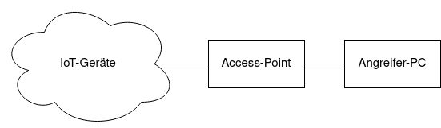
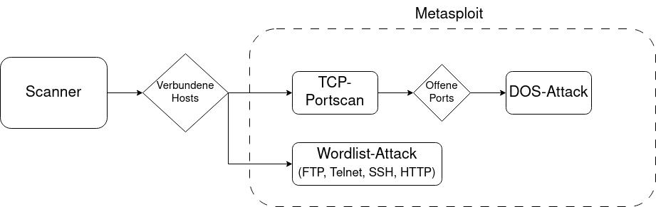

# Dokumentation des IT-Sicherheit-Praktikums WiSe22/23 - Angreifer-Gruppe

Gruppenmitglieder: Cuong Vo Ta, Max Mischinger, Florian Reiner

# 1. Einleitung
Ziel des IT-Sicherheit-Praktikums im WiSe22/23 war es, eine Toolchain aufzubauen, die den Netzwerkverkehr von Smart Home-Komponenten automatisch aufzeichnet, labelt und klassifiziert. Die Angreifer-Gruppe war dabei dafür zuständig, Angriffe auf die IoT Geräte im Netzwerk zu simulieren und die Netzwerkpakete der Angriffe so zu kennzeichnen, dass diese am Access-Point klassifiziert werden können.



Hier ist der Aufbau des Netzwerks für das Praktikum zu sehen.

## 1.1 Das Projekt
Das vorliegende Projekt beinhaltet ein run-Skript, das nacheinander verschiedene Netzwerkscans und Angriffe auf IoT-Geräte im Netzwerk durchführt. Die Scans und Angriffe sind dabei modular aufgebaut, so dass sie einfach erweitert werden können und neue Scanmethoden und Angriffe einfach implementiert werden können.



Hier ist der Aufbau der Angriffe auf die IoT-Geräte im Netzwerk zu sehen. Das Netzwerk wird erst auf verbundene Hosts gescannt. Für jeden Host werden anschließend mit Hilfe von Metasploit Modulen verschiedene Angriffe durchgeführt.

## 1.2 Metasploit

Metasploit ist ein IT-Sicherheitsprojekt, das von Rapid7 entwickelt wird. Es bietet Informationen über Sicherheitslücken und Penetrationstests. Als Teilprojekt wurde das Metasploit-Framework entwickelt, um Exploits entwickeln und ausführen zu können. Die Version 6.2.37 fasst mittlerweile 2278 Exlpoits. Es gibt sieben verschiedene Exploitarten bzw. [Module](https://www.infosecmatter.com/metasploit-module-library/). Für unser Projekt haben wir **Exploits** und **Auxiliary** verwendet:

* **Exploits:** Dient dem Eindringen in ein Zielsystem, indem eine Schwachstelle bzw. ein Programmierfehler ausgenutzt wird (Buffer Overflow, Code Injection, ...)
* **Auxiliary:** Mit Auxiliarys werden keine Payloads auf dem Zielrechner ausgeführt. Diese dienen eher dazu Informationen über das Zielsystem zu sammeln und potentielle Schwachstellen zu identifizieren

Nützliche Kommandos, um die Metasploit-Konsole zu benutzen:

* Starten der Metasploit-Konsole (Sudo verwenden, da einige Module Admin-Rechte benötigen)

    ```sudo msfconsole```

* **search:** Damit können die Exploits durchsucht werden:

    ```search exploits```

* **info:** Erhalte Informationen über einen bestimmten Exploit (Beschreibung und mögliche Optionen)

    ```info auxiliary/scanner/portscan/tcp```


* **use:** Exploit benutzen

    ```use auxiliary/scanner/portscan/tcp```


* **options:** Zeige die möglichen Optionen des aktuellen Exploits an

    ```options``` oder ```show options```

* **set:** Setzen einer Option

    ```set RHOSTS 192.168.12.200```

* **run:** Starten des Exploits mit den gesetzten Optionen

    ```run```


# 2. Installation
Benötigte Software:

 * [Nmap](https://nmap.org/)
 * [Metasploit](https://www.metasploit.com/)
 * [Wireshark](https://www.wireshark.org/) (Empfohlen, um den erzeugten Netzwerkverkehr zu kontrollieren)
 * Python (Version 3.10 oder höher)

Es wird empfohlen, die Angriffe in einer Kali Linux Installation auszuführen. Kali Linux ist eine Linux Distribution, die für die Bereiche Sicherheitsforschung und Penetrationstests angepasst ist und alle benötigten Programme von Haus aus enthält.

Benötigte Python Pakete:

* [python-nmap](https://pypi.org/project/python-nmap/)>=0.7.1
* [netifaces](https://pypi.org/project/netifaces/)>=0.11.0
* [pymetasploit3](https://pypi.org/project/pymetasploit3/)>=1.0.3
* [pyshark](https://pypi.org/project/pyshark/)>=0.5.3
* [scapy](https://pypi.org/project/scapy/)>=2.5.0

Die Python Packages können mit der beiliegenden `requirements.txt` installiert werden:

`sudo pip3 install -r requirements.txt`

Da das Skript mit root-Rechten gestartet werden muss, müssen die Python Pakete auch für den root User installiert werden.

# 3. Durchführung des Angriffs
Bevor die Angriffe ausgeführt werden können, muss Metasploit als Deamon gestartet werden. Das geschieht über diesen Befehl:

`msfrpcd -P your_password`

Das verwendete Passwort muss in `src/settings.py` in die Konstante `METASPLOIT_PASSWORD` eingetragen werden

Anschließend kann das run-Skript kann mit folgendem Befehl aus dem Projektverzeichnis heraus gestartet werden:

`sudo python src/run.py`

Dabei muss das run-Skript mit root-Rechten ausgeführt werden, damit die Bibliotheken die nötigen Rechte für Netzwerkscans und zum Verschicken von Netzwerkpaketen haben.

In der vorliegenden Version werden im run-Skript die in Kapitel 4 beschriebenen Angriffe der Reihe nach ausgeführt. Der Name des Netzwerkadapters, über welche die Angriffe laufen sollen, kann über die Konstante `NETWORK_ADAPTER_NAME` in `src/settings.py` gesetzt werden und sollte den Namen des Netzwerkadapters, die mit dem Netzwerk verbunden ist, in dem auch die IoT-Geräte verbunden sind, als String beinhalten.

Alle Angriffe werden für alle Geräte, die mit dem Netzwerk des angegebenen Netzwerkadapters verbunden sind. Deshalb muss darauf geachtet werden, dass der richtige Netzwerkadapter angegeben wurde und sich in dem Netzwerk nur Geräte befinden, die für Testzwecke angegriffen werden dürfen.

Das run-Skript versendet vor und nach jedem Angriff start- und stop-Packete, mit denen der durch die Angriffe erzeugte Netzwerkverkehr am Access-Point klassifiziert werden kann.

# 4. Module
## 4.1 Scanner
Der Scanner ist dafür verantwortlich die Hostscans durchzuführen. Er verwaltet Informationen wie offene Ports, MAC und IP Adressen in der Host Datenklassen.

```python
class Host:
    def __init__(self, ip: str, mac: str = "", ports: Optional[list[int]] = None):
        self.ip: str = ip
        self.mac: str = mac
        self.ports = [] if ports is None else ports
        self.filtered_ports = {"all": self.ports}
        self.filter_needs_update = False
        self.new_ports = []
        
    def add_filtered_port(self, name: str, ports: list[int]):
            self.filtered_ports[name] = ports
```
Das Scannen und Befüllen der Host Entitäten geschieht automatisch, beim Initialisieren der Klasse (steuerbar über 
optionalen ```initial_scan``` Parameter) oder über die Methode ```search_hosts()```. Diese durchsucht alle 
angeschlossenen Netzwerke nach Hosts und legt die Host Objekte an. Diese werden ind er Liste ```Scanner.hosts``` 
gespeichert. Sollen zusätzlich Portscans durchgeführt werden, kann die ```scan_ports()``` Methode aufgerufen werden. 
Diese führt Portscans für alle in ```Scanner.hosts``` aufgeführten Hosts durch. 

### 4.1.1 Filter
Der Scanner kann durch Filter erweitert werden. Diese haben den Zweck Funktionalitäten zu implementieren um Dienste und 
Services auf Ports zu erkennen. Sie operieren immer auf einem einzelnen Host. Werden Ports mit dem entsprechenden Ports 
auf dem Host gefunden, sollte ein Filter eine Liste dieser zurückgeben. 
```python
class Filter:
    name = "generic"

    def __init__(self, ip: str, ports: list[int]):
        pass

    def filter_ports(self):
        pass
```
Spezielle Filter erben von der oben aufgeführten Filter Klasse bzw. müssen einen Namen als Attribut speichern und die 
```filter_ports()``` Methode implementieren. ```filter_ports()``` gibt als Rückgabewert eine Liste zurück, die die 
Portnummern enthält, die den gewünschten Dienst aufführt.

Ein Filter kann der ```Scanner.filter_ports()``` Funktion im Scanner als Argument übergeben werden. Nach der Ausführung 
ist das Dictionary ```Host.filtered_ports``` eines jeden Hosts in ```Scanner.hosts``` um einen Key erweitert, der dem 
Namen des Filters ```Filter.name``` entspricht. Die Value ist eine Liste der Ports, die den durch den Filter erkannten
Dienst anbieten. Ein Beispiel für einen Filter ist in der ```TelnetFilter``` Klasse implementiert.


## 4.2 Angriffe
Die Angriffsmodule benutzen Metasploit, um Angriffe auf verbundene Geräte im Netzwerk durchzuführen.

### 4.2.1 TCP-PortScan
Es wird ein voller TCP Verbidndungsversuch auf alle angegebenen Ports durchgeführt, um nach offenen TCP Services zu suchen. Für dieses Modul werden keine Administrator-Rechte benötigt.

* Modul in Metasploit: ```auxiliary/scanner/portscan/tcp```

### 4.2.2 Denial-Of-Service (DOS)
Mit diesem Modul kann eine Denial-of-Service Attacke gestartet werden. Dafür flutet der Angreifer-PC das Zielgerät mit TCP SYN Paketen.

* Modul in Metasploit: ```auxiliary/dos/tcp/synflood```

### 4.2.3 Wortlisten Angriffe
Das Modul testet aus einer Datei verschiedene Nutzer-Passwort Kombinationen und gibt erfolgreiche Logins zurück. Das Modul kann auch mit einem Datenbank-Plugin verknüpft werden, um erfolgreiche Logins und die Zielrechner IP-Adresse zu speichern. 


| Service      | Modul in Metasploit                   |
|--------------|---------------------------------------|
| FTP          | auxiliary/scanner/ftp/ftp_login       |
| Telnet       | auxiliary/scanner/telnet/telnet_login |
| SSH          | auxiliary/scanner/ssh/ssh_login       |
| HTTP         | auxiliary/scanner/http/http_login     |


## 4.3 Klassifizierungs-Pakete
Um den Netzwerkverkehr, der durch die Scans und Angriffe erzeugt wird, am Access-Point klassifizieren zu können, werden UDP Pakete erzeugt und verschickt, die jeweils den Beginn und das Ende eines Scans oder Angriffs kennzeichnen. Die Pakete beinhalten als Payload einen JSON-kodierten String, der die nötigen Informationen zur Klassifizierung der Netzwerkpakete enthält. Der Payload ist folgendermaßen aufgebaut:

```json
{
    "attack": "test",
    "target": "192.168.1.100",
    "mac": "01:23:45:67:89:AB",
    "type": "start",
    "time": 1234567890000
}
```
Im Feld `attack` steht der Name der ausgeführten Attacke. In den Feldern `target` und `mac` sind die IP-Adresse und die MAC-Adresse des angegriffenen Ziels kodiert. In `target` steht `"start"` oder `"stop"` womit der Beginn bzw. das Ende eines Angriffs angezeigt wird. Im Feld `time` wird schließlich der aktuelle Unix timestamp in Millisekunden kodiert.

Im run-Skript werden die start- und stop-Pakete über den Kontextmanager `AttackNoticePackets` eingebunden, der  als Argumente den Namen des Angriffs, die IP-Adresse (bei Angriffen ohne konkretes Ziel steht hier die IP-Adresse des Access-Points) des Ziels und die MAC-Adresse des Ziels (wenn dieses Argument leer ist, wird die MAC-Adresse des angreifenden Rechners benutzt; z.B. bei Netzwerkscans, die kein eindeutiges Ziel haben) übergeben bekommt.

# 5. Neue Angriffe
Um einen neuen Angriff ins run-Skript einzubinden, kann die Funktion, die den Angriff triggert, an einer sinnvollen Stelle hinzugefügt werden. Dabei sollte vorher die Klasse `AttackNoticePackets` initialisiert werden, damit die nötigen start- und stop-Pakete korrekt versendet werden. Folgendes Beispiel zeigt, wie ein neuer Angriff auf einen verbundenen Host ins run-Skript eingefügt werden kann:

```python
with AttackNoticePackets("new_attack", connected_ip[0], connected_ip[1]):
    run_new_attack(*args)
```

# Weiterführende Links
* [Kali Linux](https://www.kali.org/)
* [Metasploit Documentation](https://docs.metasploit.com/)
* [Metasploit Module Library](https://www.infosecmatter.com/metasploit-module-library/)


